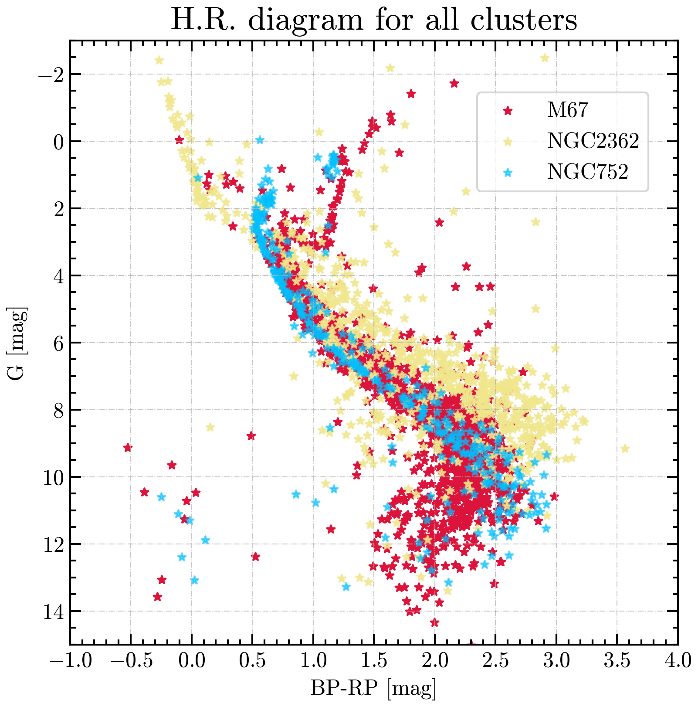

# Astrophysics-Coursework
This repository contains my solutions for homework problems about stars (Hertzsprung–Russell diagram), interstellar medium (ISM) and exoplanets. I hope they can be useful.

**Note:** MAY stands for my name.

  

The course material can be found [here](https://github.com/helgadenes/Astrophysics_yachay).
